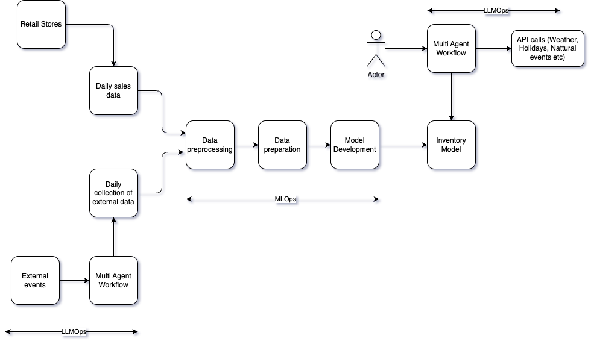

# 🧠 Inventory Forecasting System ML & LangGraph based Multi Agent Workflow

This repository presents a hybrid system that integrates Machine Learning Model and LangGraph based AI Multi Agent workflow to forecast product inventory needs in the retail industry using both internal (sales) and external (weather, holiday, disaster) data.

---

## 📊 Architecture Diagram



---

## 🏬 Data Sources

- **Retail Stores**: Provide daily sales data (e.g., product SKUs, quantities, dates).
- **External Events**: Include holidays, policy changes, strikes, weather, and natural disasters.

---

## 🔄 Data Ingestion & Collection

- **Daily Sales Data**: Gathered from retail stores.
- **External Data**: Retrieved through a multi-agent workflow powered by LLMOps, calling APIs for:
  - Weather forecasts
  - Holiday calendars
  - Disaster alerts
  - Economic events

---

## ⚙️ MLOps Workflow

1. **Data Preprocessing**:
   - Cleans and formats raw sales and external event data.

2. **Data Preparation**:
   - Merges internal and external data into a feature-rich dataset.
   - Applies feature engineering (e.g., flags for `is_holiday`, `disaster_severity`, `weather_event`).

3. **Model Development**:
   - Uses XGBoost or other models to learn sales patterns.
   - Evaluates and stores the trained inventory forecasting model.

---

## 🤖 LLMOps & Multi-Agent Workflow

- Users interact with the system through a **LangGraph multi-agent interface**.
- Agents gather contextual data via API calls (e.g., weather on a future date).
- These agents feed real-time data into the prediction pipeline, enabling on-demand inventory forecasts.

---

## 🔁 Automation & Optimization

- **MLOps** handles:
  - Automation of pipelines
  - Continuous model training
  - Monitoring and retraining based on drift

- **LLMOps** handles:
  - Coordination of agents for external insights
  - Intelligent response generation
  - Orchestration of tool-based workflows

---

## ✅ Key Benefits

- Accurate, real-time, **context-aware inventory forecasting**
- Reduces risk of overstocking or understocking
- Fully **automated** and **scalable**
- Supports **multi-agent AI orchestration**

```

## 📁 Project Structure

├── Hackathon_industry.drawio.png # System architecture diagram
├── inventory_predictor.py # Model interface code
├── model artifacts (.pkl, .csv) # Data and model files
├── agent_toolkit/ # LangGraph agent tools
└── README.md # This file


```

## 🚀 Getting Started

> To run locally or in Colab, ensure you have:
- Python 3.10+
- Required packages from `requirements.txt`
- Access to external APIs (Open-Meteo, GoogleCalender,Tavily, etc.)

---

## 📬 Contact

For collaboration or questions, please open an issue or contact Senthil Nathan.


